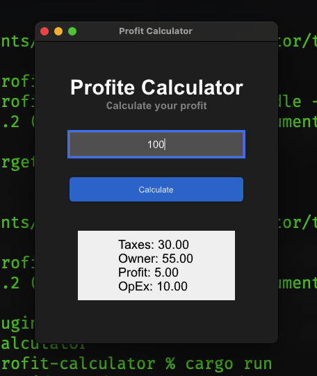

# Profit Calculator for **Multi Platform**

### Preview of Calculator

| Lanchpad                         | Spotlight                         | Output                         |
| -------------------------------- | --------------------------------- | ------------------------------ |
|  |  |  |

## Usage

1. Install Rust by following the [Rust Getting Started Guide](https://www.rust-lang.org/learn/get-started).
   Once this is done, you should have the `rustc` compiler and the `cargo` build system installed in your path.
2. Install [`cargo-generate`](https://github.com/cargo-generate/cargo-generate)
   ```bash
   cargo install cargo-generate
   ```
3. Clone this repository and open with your code editor/IDE
   ```bash
   git clone http://github.com/devlopersabbir/profit-calculator
   cd profit-calculator
   ```
   > Make your changes or review my code 😅
4. Build with cargo
   ```bash
   cargo build
   ```
5. Run the application binary
   ```bash
   cargo run
   ```

Recommend using an IDE for development, along with our [LSP-based IDE integration for `.slint` files](https://github.com/slint-ui/slint/blob/master/tools/lsp/README.md). You can also load this project directly in [Visual Studio Code](https://code.visualstudio.com) and install our [Slint extension](https://marketplace.visualstudio.com/items?itemName=Slint.slint).
